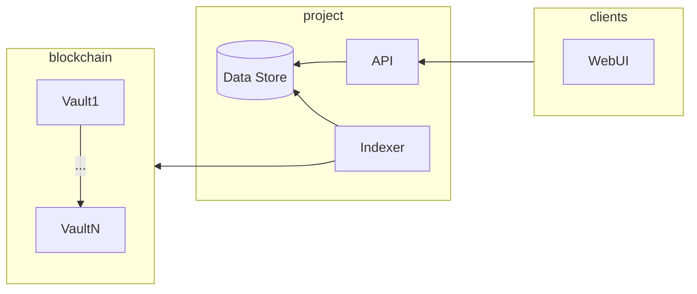
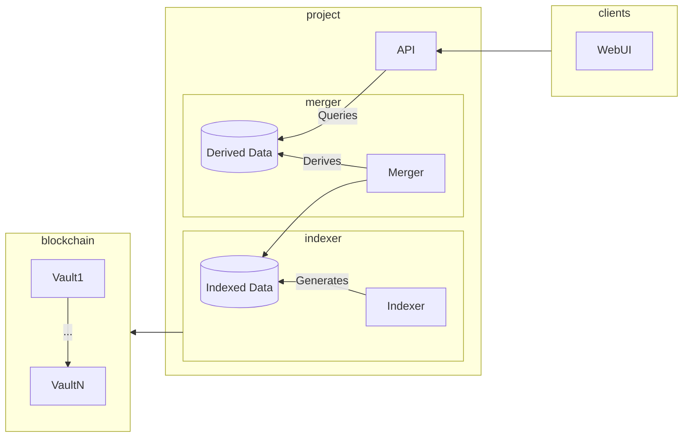

# Introduction

This documents evaluate technical solutions to fulfill the following requirements.
We prioritize fulfilling the requirements while optimising for operational efficiency.

# Requirements

## Feature 1: Platform usage and treasury inflow

- Display historical and live data per vault
  - Can be aggregated to 15 min if needed, allow for higher time frame aggregations (1d, 1w, etc)
  - Live data: allow for 1h delay
  - All data can be requested in "want" token, in native equivalent, and in USD equivalent.
  - Data needed:
    - TVL
    - Vault deposits and withdraws
    - Vault harvest (with details for treasury, harvester, strategist)
- Display revenu <> $BIFI relationship
  - bifi staker revenue <= IDK HOW THIS IS COMPUTED
  - historical buyback amount?

## Feature 2: Detailed tracking of individual user investments

- Display user investments history (per address)
  - Can be aggregated to 15 min if needed, allow for higher time frame aggregations (1d, 1w, etc)
  - Live data: allow for 1h delay
  - All data can be requested in "want" token, in native equivalent, and in USD equivalent.
  - Data needed:
    - Historical investment value (moo token amount and price over time)
  - Derived data
    - Average deposit price
    - P&L + IL

# Architecture

## Overview



This project will be split in 3 parts:

- Indexer:
  - Knows how to fetch data from the blockchain
  - Is able to retrieve historical and live data
- Historical data store:
  - Be the "source of truth" for historical data
  - Needed because blockchain data access is too slow
- API:
  - provide a stable and performant interface
  - maybe do some caching

## Operational requirements/notes

- Adding a new vault should not require code change. Ideally we will maintain an on-chain registry of all vaults.
- We want to minimize interaction with the vault strategies (events and calls) as those are less standardized (api and events) than vaults.
- We want to use events as much as possible compared to contract calls as events are easier to access and more efficient.
- We can rely heavily on ERC20 events and methods to get data from the vault. This is very standard, could scale to other needs.
- We could rely on external price feeds if on-chain oracles are not available, but it's not advised.
- We do not aim to decentralize the runtime of this project, the source code will be open so anyone could run an instance.

## Individual data sources

- Moo token history amount per address
  - Result of proof of concept: can be fetched efficiently from the vault ERC20 transfer event
  - We use ERC20 transfers because most vault do not trigger an event when a deposit is made, it seems to be the strategy role to do so, so we avoid using those events (see above op req)
  - Doing so is compatible with EIP4626
- Moo token price in "want"
  - Result of proof of concept: can be fetched at regular interval in the past by passing a block number to the contract call "pricePerFullShare()"
  - Might require a special RPC node for older vaults (archive node)
- LP token price
  - Beefy already have an LP price feed based on thegraph
  - Beefy LP price feed is maintained by strategists and is difficult to maintain, if possible, automate this process (unlikely). If not, make sure this price feed is easy to update and changes are propagated to the beefy api and data project.
- TVL (in "want") for each vault
  - call balance() on the vault contract with a block number at regular intervals in the past
- Harvests
  - Assumption: collecting harvest data only benefit Feature 1, as Feature 2 (users details) requirements are fulfilled enough by fetching pricePerFullShare()
  - Harvest amount:
    - TODO
  - Harvest fees:
    - Assumption: harvests convert all to native before splitting between harvester, strategist and treasury
    - Assumption: no custom event is reliably used enough to be used as a source of truth for fees
    - TODO

## Implementation solutions

- Monolythic approach
  - Everything intergated in the same project, exposing a single REST API
  - Pros:
    - Easy to implement and iterate on new features
  - Cons:
    - Can quickly become a tangled mess of code, will have to be strict about modules
    - More difficult to transform into an asset for other projects as we don't expose raw data
- Split in 2 projects: the indexer / raw data archive + the aggregated api
  - Pros:
    - Having a raw data archive is a good way to include other projects and having
  - Cons:
    - Can introduce latency
    -
- Something else?



###############################################################################################
###############################################################################################
########################### WIP ###########################
###############################################################################################
###############################################################################################

# Component design

TODO: design API first

- Indexer responsibility is to know which data to get and how to get it. IE: knows about vault list, knows how to get shares, etc.
- Data store exposes public raw data for each individual data sources. IE: shares history, shares to "want" rate history, "want" oracle usd price history, etc.
- Api merges these raw data and provide easy access to merged data. IE: multiply shares with "want" rate with "want" oracle price to return usd price or shares directly, etc.

## Indexer

TODO

- evaluate the graph maybe
- can we reuse the vault registry or do we need a new one? (maybe we need oracle addresses, some additional config etc)

## Data store

TODO

- Most data we need to store is actually derived data from the blockchain
- I intuitively think that storing historical data in a file format is inherently the way to go
  - Dirt cheap to operate (store, copy, backup, etc)
  - No server = no problems
  - Avoid the database war
  - We can still derive additional data and put it in an SQL db if needed
  - This is what large players in the industry use to store and distribute historical data (see: https://public.bybit.com)
  - Other projects could easily integrate with a public file server directly, less likely with a database as they will need to rely on the api
  - Having an SQL server is what people expect though
- Data store will ultimately depend on how the data is used

## API

TODO

- should we return JSON (more standard) or CSV (streamable, concatenable, a bit more difficult to parse)

### Requirements / Notes

Operational requirements:

- Need to scale
- Most calls should return from cache
- Resilient to updates and crashes (fast startup)

Notes:

- Values are expressed as string decimals with a dot as separator. Ex: "1023212323.23456789". Spec below uses "Decimal"
- Vault id is the checksumed vault address. Ex: "0x1234567890123456789012345678901234567890". Spec below uses "Address"

Design decisions:

- As a result of operational requirements, we choose to expose low level data structures directly and let clients built on top of them. This decision will allow us to maintain a very generic API that will require less code changes to support new features. The downside of this decision it that it will require clients more code to support a single end user feature. Ex: we expose shares history, shares "want" rate and "want" usd rate, it is up to the client to multiply those values to display the total amount

### REST interface

#### Feature 1

#### Feature 2

```
GET /api/shares-history/:owner_address/:chain/:vault_address?agg=:agg&currency=:currency&before=:before&after=:after
    Where:
        - chain: "fantom", "bsc", ...
        - owner_address: address of the user, owner of moo token
        - vault_address: address of the target erc20 moo token
        - agg: "15m", "1h", "4h", "1d", "1w", "1m", "1y"
        - currency: "usd", "want", "native"
        - before: ISO8601 UTC date and time (inclusive)
        - after: ISO8601 UTC date and time (inclusive)
    Returns:
        - historical data in the requested currency ordered by date
        - null if not yet invested, 0 if fully withdrawn
        - we choose a columnar representation to have less bytes to transfer compared to a list of js objects
        {
            dates: Array<Date>,
            shares: Array<Decimal|null>,            // amount of shares owned by the user
            usd_value: Array<Decimal|null>,         // us dollars equivalent of the shares
            underlying_value: Array<Decimal|null>,  // underlying token amount equivalent of the shares
            native_value: Array<Decimal|null>,      // native amount equivalent of the shares
        }

GET /api/shares-history/:owner_address/:chain?agg=:agg&currency=:currency&before=:before&after=:after
    Where:
        - chain: "fantom", "bsc", ...
        - owner_address: address of the user, owner of moo token
        - agg: "15m", "1h", "4h", "1d", "1w", "1m", "1y"
        - currency: "usd", "native"
        - before: ISO8601 UTC date and time (inclusive)
        - after: ISO8601 UTC date and time (inclusive)
    Returns:
        - aggregated historical data over all vaults of a chain for this user
        - null if not yet invested, 0 if fully withdrawn
        - we choose a columnar representation to have less bytes to transfer compared to a list of js objects
        {
            invested_in: Array<Address>             // list of vaults where the user has positive investment in
            dates: Array<Date>,
            shares: Array<Decimal|null>,            // amount of shares owned by the user
            usd_value: Array<Decimal|null>,         // us dollars equivalent of the shares
            underlying_value: Array<Decimal|null>,  // underlying token amount equivalent of the shares
            native_value: Array<Decimal|null>,      // native amount equivalent of the shares
        }

```
