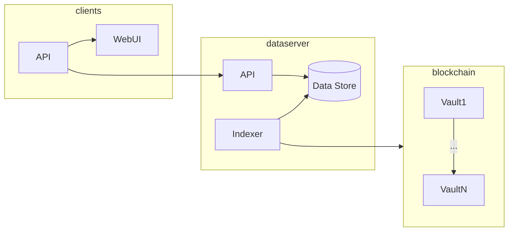
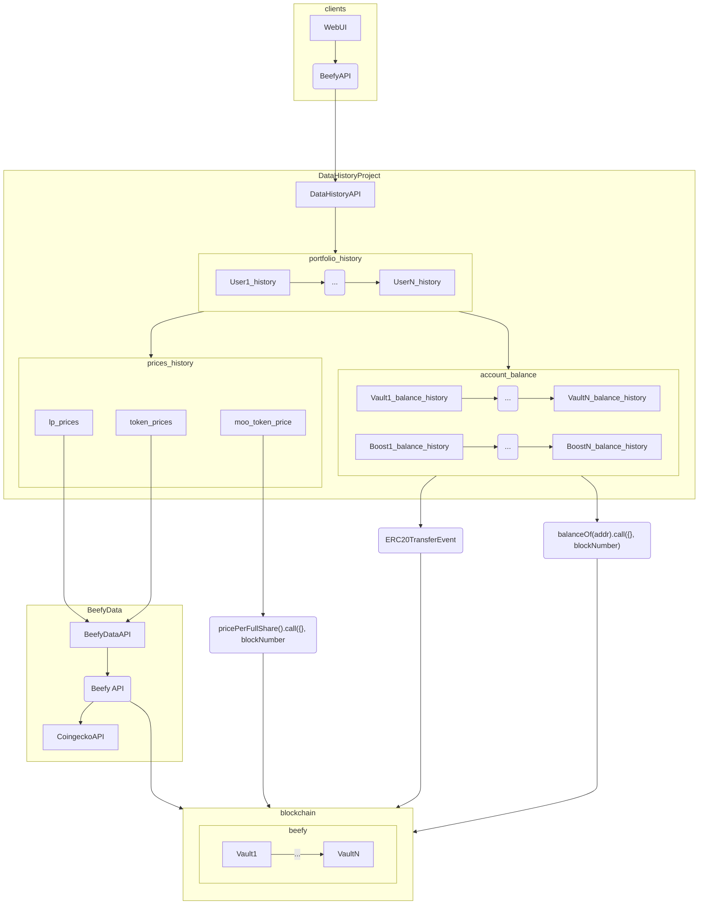
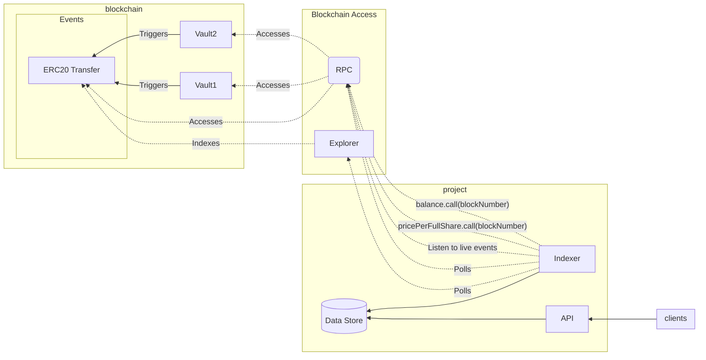
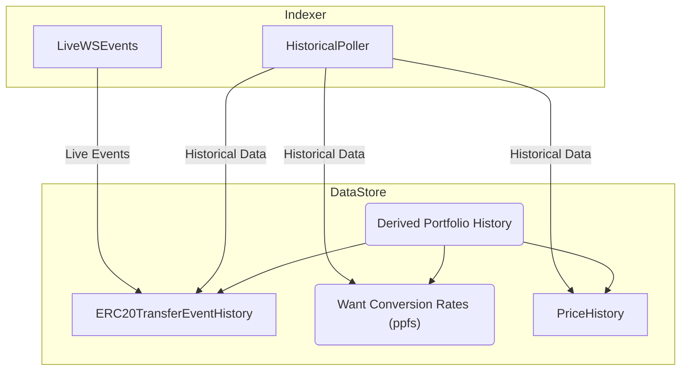

# Introduction

This documents evaluate technical solutions to fulfill the following requirements.
We prioritize fulfilling the requirements while optimising for operational efficiency.

# Requirements

## Beefy Org: Platform usage and treasury inflow

- Display historical and live data per vault
  - Can be aggregated to 15 min if needed, allow for higher time frame aggregations (1d, 1w, etc)
  - Live data: allow for 1h delay
  - All data can be requested in "want" token, in native equivalent, and in USD equivalent.
  - Data needed:
    - TVL
    - Vault deposits and withdraws
    - Vault harvest (with details for treasury, harvester, strategist)
- Display revenu <> $BIFI relationship
  - bifi staker revenue <= IDK HOW THIS IS COMPUTED
  - historical buyback amount?

Questions to answer:

- the effectiveness of marketing activities on vault tvl
- the effect of launchpools, also does the tvl stay after the launchpool ends
- harvests -> purely profit, how much are we earning from stable vaults, how much are degen vaults generating, precise amount of - monthly treasury inflow? -> this then enables us to run new scenarios, if fees were modified to X, Y and Z, how would the impact on bifi stakers and treasury revenue be?

NOTE:

- the proof of concept has answered some if not all of the above questions so we son't be focusing on those right now

## Investor: Detailed tracking of individual user investments

- Display user investments history (per address)
  - Can be aggregated to 15 min if needed, allow for higher time frame aggregations (1d, 1w, etc)
  - Live data: allow for 1h delay tops, optimise for as low delay as possible for latest transactions
  - All data can be requested in "want" token, in native equivalent, and in USD equivalent.
  - Data needed:
    - Historical investment value (moo token amount and price over time)
    - LP breakdown
  - Derived data
    - Average deposit price
    - P&L + IL

# Architecture

## Overview



This project will be split in 3 parts:

- Indexer:
  - Knows how to fetch data from the blockchain
  - Is able to retrieve historical and live data
- Historical data store:
  - Be the "source of truth" for historical data
  - Needed because blockchain data access is considered too slow
- API:
  - provide a stable and performant interface
  - maybe do some caching

## Operational requirements/notes

- Adding a new vault should not require code change. Ideally we will maintain an on-chain registry of all vaults.
- We want to minimize interaction with the vault strategies (events and calls) as those are less standardized (api and events) than vaults.
- We want to use events as much as possible compared to contract calls as events are easier to access and more efficient.
- We can rely heavily on ERC20 events and methods to get data from the vault. This is very standard, could scale to other needs.
- We could rely on external price feeds if on-chain oracles are not available, but it's not advised.
- We do not aim to decentralize the runtime of this project, the source code will be open so anyone could run an instance.

## Individual data sources

- Moo token history amount per address
  - Result of proof of concept: can be fetched efficiently from the vault ERC20 transfer events
  - We use ERC20 transfers because most vault do not trigger an event when a deposit is made, it seems to be the strategy role to do so, so we avoid using those events (see above op req)
  - Doing so is compatible with EIP-4626
- Moo token price in "want"
  - Result of proof of concept: can be fetched at regular interval in the past by passing a block number to the contract call "pricePerFullShare()"
  - Might require a special RPC node for older vaults (archive node)
  - To compute a precise P&L, we'll need to get as precise ppfs as possible
- LP token price
  - Beefy already have an LP price feed based on thegraph
  - Beefy LP price feed is maintained by strategists and is difficult to maintain
  - We decide to use data from data.beefy.com which snapshots the api.beefy.com prices at regular interval
- TVL (in "want") for each vault
  - Can be derived from the vault ERC20 transfer events (negative balance of 0x000 address is the TVL)
- Harvests
  - Assumption: collecting harvest data only benefit Feature 1, as Feature 2 (users details) requirements are fulfilled enough by fetching pricePerFullShare()
  - Harvest amount:
    - TODO
  - Harvest fees:
    - Assumption: harvests convert all to native before splitting between harvester, strategist and treasury
    - Assumption: no custom event is reliably used enough to be used as a source of truth for fees
    - Result of proof of concept: we can use ERC20 transfer events to get the harvest details
- LP Breakdown
  - Used to compute token exposure and IL
  - The api already provides the current breakdown for the various LPs
  - API code must be refactored to reuse the LP breakdown code to get the historical values
  - API needs to implement some sort of refactoring safety net before that happens (aggressive ts compiler options and/or tests)

In the future, we could derive APR and APY from this data, but it's not the goal of the first version.

## Data store capacity analysis

Data Sizing Estimates:

```
- Vaults to track: ~2000, design for ~5000
- Accounts per vault: ~500, design for ~1000. Note: popular vaults can have 10k~30k accounts
- Time sampling: 4h (>1y), 1h (>1m), 15min (<1m) timestep -> 30*24*4 + 11*30*24 + 365*6 -> 13k data points
- Data to store:
    - Deposit/withdraw:
        - ERC20 transfers from/to vaults:
            - With from/to (feat2)
                - 10~30 / account / vault -> 1000*5000*30 -> 150M data points
                - values: from/to (address 160 bit) + value (256 bit) + timestamp (64 bit)
                - dimensions: vault address (160 bit) + chain (8 bit)
                - 150M*480bit -> 9 gigabytes + dimensions
            - Without from/to (feat1)
                - 5000 vaults \* ~2000 deposit/withdraws -> ~10M data points
                - values: value (256 bit) + timestamp (64 bit)
                - dimensions: vault address (160 bit) + chain (8 bit)
                - 10M*320bit -> 400 megabytes + dimensions
    - PPFS: 1 / vault / ts point
        - values: price per full share (256 bit) + timestamp (64 bit)
        - dimensions: vault address (160 bit) + chain (8 bit)
        - 5000 * 13k -> 65M data points -> 65M*320bit -> 2.6 gigabytes + dimensions
    - Vault strat list
        - Negligible, max 5 / vault -> 25k
    - Prices:
        - ~3/vault (lp + underlying 1 + underlying 2), but many overlap
        - values: price approx usd (32 bit) + price approx native (32 bit) + timestamp (64 bit)
        - dimensions: chain (8 bit)
        - 3000 (5k - overlap) * 3 * 13k -> 117M data points -> 117M*128bit -> 1.8 gigabytes + dimensions
    - Harvests:
        - 1 / vault / ts point (aggregate if needed)
        - values: harvest approx usd (32 bit) + harvest approx native (32 bit) + split strategist/harvester/treasury 3 * 32 bit + timestamp (64 bit)
        - dimensions: chain (8 bit) + vault address (160 bit)
        - 5000 * 13k -> 65M data points -> 65M*224bit -> 1.8 gigabytes + dimensions
- Total (uncompressed):
    - Deposit/withdraws counts (feat1): ~500Mb
    - PPFS: ~3Gb
    - Prices: ~2Gb
    - Harvests: ~2Gb
```

Data Sizing from real world POC:

```
CSV storage
-----------

- Vaults to track: 2000
$ find . -type f -name vaults.jsonl | xargs cat | wc -l
2000

- Accounts per vault: 565
$ find . -type f -name Transfer.csv | grep -v ERC20_from_self | xargs cat | cut -d',' -f 4 | uniq | sort | uniq | wc -l
302421
$ find . -type f -name Transfer.csv | grep -v ERC20_from_self | wc -l
2013
$ find . -type f -name Transfer.csv | grep -v ERC20_from_self | xargs -I {} sh -c 'cat {} | cut -d',' -f 4 | uniq | sort | uniq | wc -l' | awk '{ total += $1; count++ } END { print total/count }'
565.841

- Time sampling: not dependent on actual data

- Data to store:
    - Deposit/withdraw:
        - ERC20 transfers from/to vaults: 2550 transfer / vault -> ~5M data points, ~700 Mb
            $ find . -type f -name Transfer.csv | grep -v ERC20_from_self | xargs -I {} sh -c 'cat {} |  wc -l' | awk '{ total += $1; count++ } END { print total/count }'
            2538.87
            $ find . -type f -name Transfer.csv | grep -v ERC20_from_self | xargs cat | wc -c
            709729820
        - PPFS: 1 / vault / ts point -> but PoC revealed we need 15min precision minimum.
    - Prices: 2571 token to track, 65M data points -> ~3Gb
        $ ls | wc -l
        2571
        $ find . -type f -name price_15min.csv | xargs cat | wc -l
        65762903
        $ du -sh ./
        2.8G    ./


Timescaledb Storage:
--------------------

Timescaledb have been fed on csv data only so we only consider the size of each table, the size of materialized views (continuous or not) and the size of indices.

beefy=> select pg_size_pretty(pg_database_size('beefy'));
 pg_size_pretty
----------------
 8931 MB
(1 row)

with timescale_objects as (
    select
        'hypertable' as object_type,
        hypertable_schema || '.' || hypertable_name as table_display_name,
        hypertable_schema || '.' || hypertable_name as table_internal_name
    from timescaledb_information.hypertables
    UNION ALL
    select
        'continuous aggregate' as object_type,
        hypertable_schema || '.' || hypertable_name as table_display_name,
        materialization_hypertable_schema || '.' || materialization_hypertable_name as table_internal_name
    from timescaledb_information.continuous_aggregates
)
select ht.object_type, ht.table_display_name, ht.table_internal_name,
    pg_size_pretty(htds.table_bytes) as table_size,
    pg_size_pretty(htds.index_bytes) as index_bytes,
    pg_size_pretty(htds.toast_bytes) as toast_bytes,
    pg_size_pretty(htds.total_bytes) as total_bytes
from timescale_objects as ht,
lateral (
    select
        sum(table_bytes) as table_bytes,
        sum(index_bytes) as index_bytes,
        sum(toast_bytes) as toast_bytes,
        sum(total_bytes) as total_bytes
    from hypertable_detailed_size(ht.table_internal_name)
) as htds
order by htds.total_bytes desc
;
     object_type      |       table_display_name       |                table_internal_name                | table_size | index_bytes | toast_bytes | total_bytes
----------------------+--------------------------------+---------------------------------------------------+------------+-------------+-------------+-------------
 hypertable           | data_report.vault_stats_4h_ts  | data_report.vault_stats_4h_ts                     | 1038 MB    | 57 MB       | 457 MB      | 1552 MB
 continuous aggregate | data_raw.erc20_balance_diff_ts | _timescaledb_internal._materialized_hypertable_9  | 902 MB     | 413 MB      | 96 kB       | 1315 MB
 continuous aggregate | data_report.vault_stats_4h_ts  | _timescaledb_internal._materialized_hypertable_12 | 21 MB      | 2496 kB     | 899 MB      | 923 MB
 hypertable           | data_raw.oracle_price_ts       | data_raw.oracle_price_ts                          | 422 MB     | 50 MB       | 403 MB      | 874 MB
 continuous aggregate | data_report.vault_stats_4h_ts  | _timescaledb_internal._materialized_hypertable_13 | 1688 kB    | 288 kB      | 690 MB      | 692 MB
 continuous aggregate | data_raw.oracle_price_ts       | _timescaledb_internal._materialized_hypertable_8  | 268 MB     | 253 MB      | 40 kB       | 521 MB
 hypertable           | data_raw.erc20_balance_diff_ts | data_raw.erc20_balance_diff_ts                    | 47 MB      | 18 MB       | 443 MB      | 509 MB
 continuous aggregate | data_raw.vault_ppfs_ts         | _timescaledb_internal._materialized_hypertable_7  | 256 MB     | 242 MB      | 56 kB       | 498 MB
 continuous aggregate | data_raw.erc20_balance_diff_ts | _timescaledb_internal._materialized_hypertable_10 | 153 MB     | 74 MB       | 96 kB       | 228 MB
 hypertable           | data_raw.vault_ppfs_ts         | data_raw.vault_ppfs_ts                            | 56 MB      | 7560 kB     | 14 MB       | 78 MB
 hypertable           | data_raw.vault_harvest_1d_ts   | data_raw.vault_harvest_1d_ts                      | 37 MB      | 3816 kB     | 672 kB      | 41 MB
(11 rows)

with timescale_objects as (
    select
        'hypertable' as object_type,
        hypertable_schema || '.' || hypertable_name as table_display_name,
        hypertable_schema || '.' || hypertable_name as table_internal_name
    from timescaledb_information.hypertables
    UNION ALL
    select
        'continuous aggregate' as object_type,
        hypertable_schema || '.' || hypertable_name as table_display_name,
        materialization_hypertable_schema || '.' || materialization_hypertable_name as table_internal_name
    from timescaledb_information.continuous_aggregates
)
select *
from information_schema.tables
where table_schema not like '%timescaledb%'
    and table_schema not in ('pg_catalog', 'information_schema')
    and table_schema || '.' || table_name not in (
        select table_internal_name from timescale_objects
        UNION ALL
        select table_display_name from timescale_objects
    );

 table_catalog | table_schema |            table_name             | table_type | self_referencing_column_name | reference_generation | user_defined_type_catalog | user_defined_type_schema | user_defined_type_name | is_insertable_into | is_typed | commit_action
---------------+--------------+-----------------------------------+------------+------------------------------+----------------------+---------------------------+--------------------------+------------------------+--------------------+----------+---------------
 beefy         | data_raw     | vault                             | BASE TABLE |                              |                      |                           |                          |                        | YES                | NO       |
 beefy         | public       | tmp_3d                            | BASE TABLE |                              |                      |                           |                          |                        | YES                | NO       |
 beefy         | data_derived | vault_ppfs_4h_ts                  | VIEW       |                              |                      |                           |                          |                        | NO                 | NO       |
 beefy         | data_derived | oracle_price_4h_ts                | VIEW       |                              |                      |                           |                          |                        | NO                 | NO       |
 beefy         | data_derived | erc20_owner_balance_diff_4h_ts    | VIEW       |                              |                      |                           |                          |                        | NO                 | NO       |
 beefy         | data_derived | erc20_contract_balance_diff_4h_ts | VIEW       |                              |                      |                           |                          |                        | NO                 | NO       |
 beefy         | data_report  | chain_stats_4h_ts                 | VIEW       |                              |                      |                           |                          |                        | NO                 | NO       |
 beefy         | data_report  | all_stats_4h_ts                   | VIEW       |                              |                      |                           |                          |                        | NO                 | NO       |
(8 rows)

```

## cloud vs on prem

```
- on prem:
    (+): cheaper to run ($100~$200 / month)
    (+): more decentralized (no dependency on specific cloud provider service -> anyone can spin an instance)
    (-): access control is more error prone
    (-): more exensive to maintain (dev time), need upgrades
    (-): need to test and maintain timeserie databases
    (~): forces us to produce more efficient code
- cloud:
    (-): more expensive to run ($300~$1000 / month) and c
    (-): less decentralized (dependency on specific cloud provider service)
    (+): access control is less error prone (revokable access)
    (+): less expensive to maintain (dev time), automatic upgrades upgrades
    (+): included timeserie / big data tools
    (~): let us produce sloppy code that have an impact on infrastructure cost

During the proof of concept, we used bigquery at first, cost 100€ for a day of use.
Switched to an on prem solution for 60€/month and it runs smoothly.
Since this indexer will not have critical data and will be optimised for low maintenance, we can afford to go on prem.
```

## Logical data flow



# Component design

- Indexer responsibility is to know which data to get and how to get it. IE: knows about vault list, knows how to get shares, etc.
- Data store exposes public raw data for each individual data sources. IE: shares history, shares to "want" rate history, "want" oracle usd price history, etc.
- Api merges these raw data and provide easy access to merged data. IE: multiply shares with "want" rate with "want" oracle price to return usd price or shares directly, etc.

## Indexer

- PoC rejected a TheGraph implementation due to lacking all target blockchains support
- Vault registry is not implemented yet



## Data store

- Most data we need to store is actually derived data from the blockchain
- Data store is responsible for:
  - de-duplicating events / merging live events and polling (idempotent on write)
  - serving derived data with relatively quick access timings given the served data is cached by clients
- PoC tested 2 approach:
  - CSV Storage:
    - Pros:
      - Dirt cheap to operate (store, copy, backup, etc)
      - No db server = very low runtime cost and no specific knowledge
      - Avoid the database war
      - We can still derive additional data and put it in an SQL db if needed
      - This is what large players in the industry use to store and distribute historical data (see: https://public.bybit.com)
      - Other projects could easily integrate with a public file server directly, less likely with a database as they will need to rely on the api
    - Cons:
      - CSV storage is not what people expect
      - It's difficult to update past data partially
      - It's hard to keep track of which time range have been fetched but there was no data found
      - Introduces a delay between the time the data is fetched and the time it is served
      - Have limitations to be dealt with manually (amount of open file descriptors)
      - Can't merge live and historical data easily
  - Timescaledb:
    - Pros:
      - good old SQL
      - Supports compression, but can't update compressed data without specific care
      - supports timeseries-specific queries like "last" and optimises for range queries
      - Has continuous aggregates which simplifies some queries
      - Easily merge live and historical data
    - Cons:
      - Can't be served easily by a public file server
      - Needs backup system
      - Needs to be designed carefully for the query usage patterns
      - Needs specific skills to operate

Given the PoC results, we decide to use TimescaleDB only to store all data and skip the CSV storage part.
As much as I like having a bunch of CSV files to act as a cache for RPC and Explorer data, it introduces a lot of complexity and is not really necessary.
On the other hand, having an SQL database is mandatory to get any live insights on the data.



## API

- API scope is: serve historical data to the client faster than what RPC and Explorer can.
- We want this api to stay as dumb as possible as we want to optimise for operational ease. IE: derived data like P&L, performance summary will be done by clients.
- We split the API in 2 deliveries:

  - 1. Serve raw historical data from ERC20 transfers, ppfs and prices history
  - 2. Serve additional data based on LP breakdown history

Design decisions:

- As a result of operational requirements, we choose to expose low level data directly and let clients built on top of them. This decision will allow us to maintain a very generic API that will require less code changes to support new features. The downside of this decision it that it will require clients more code to support a single end user feature. Ex: we expose shares history, shares "want" rate and "want" usd rate, it is up to the client to multiply those values to display the total amount
- We want to avoid references to beefy's specifics to avoid project locking and hopefully make this scale to other projects as well.

### API V1: historical data

```
GET /portfolio/{user_address}/chain/{chain_name}/vault/{vault_address}/full_portfolio_history?agg=4h
- Returns all historical data for the given address
- Returns JSONL format (streamable)
- Returns HTTP standard cache header for downstream caching: Cache-Control, expires
- Example row format: {
    date_utc: "2018-01-01T00:00:00Z", (DateTime)
    transaction_hashes: ["0x1234567890"], (string[]: Address[])
    // erc20 transfer infos
    share_balance_before: "2.00000000", (string: BigNumber)
    share_balance_after: "1.00000000", (string: BigNumber)
    share_balance_diff: "-1.00000000", (string: BigNumber)
    // historical data from price and ppfs
    share_to_underlying_rate: "1.0" || null, (string: BigNumber)
    underlying_usd_value: "1.0" || null, (string: BigNumber)
}
- ppfs and want_usd_price are null if the data is not available
- ppfs and want_usd_price are the best data we could find for all transactions in the aggregate. IE: we try to match each transaction with the closest ppfs and price, but if not possible or too expensive, we may use averages.
- No pagination, but should not return too much data as these are user-created transactions
- Data is ordered by date_utc ASC
- Agg parameter (optional): 15m, 4h, 1d, 1w. Default is 4h. 15m will not be supported on the first delivery.
```

### API V2: LP Breakdown history

```
Update the previous endpoint with this field

GET /portfolio/{user_address}/vault/{vault_id}/full_portfolio_history
- {
    ...
    underlying_breakdown: {
        total_supply: "1.00000000", (string: BigNumber)
        token_price_balance: [
            ["ETH", "1700.0", "12.332"],
            ["BTC", "23000.0", "12.332"],
        ], ((string, string: BigNumber, string: BigNumber)[])
    }
}
```
